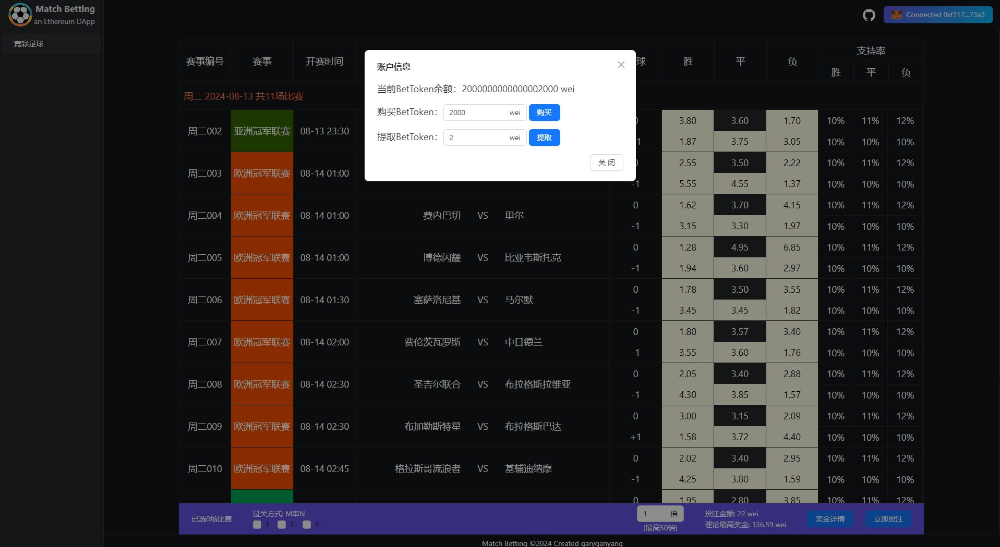

# Match Betting ÐApp⚽💰
this is a Match Betting ÐApp build on EVM(test net).

# Plan to fullfill:
1. refer to [竞彩足球 Soccer Betting](https://www.sporttery.cn/jc/jsq/zqspf/), re-design a decentralized Match Betting application;
2. build the server side, get the matches and the final scores;
3. build the web pages base on React;
4. connect to Metamask wallet;
5. build the smart contract and test;
6. deploy contract to test net like.

### Preview(预览)

  

